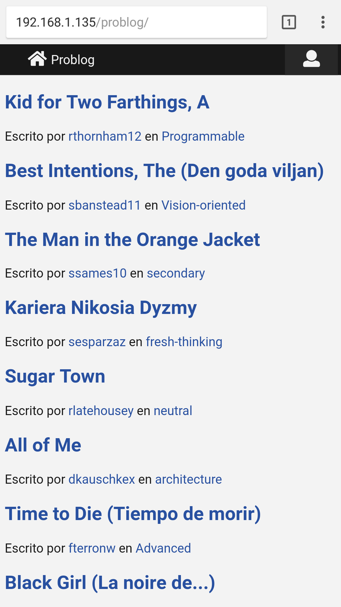
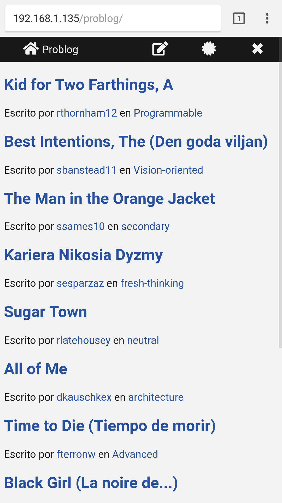
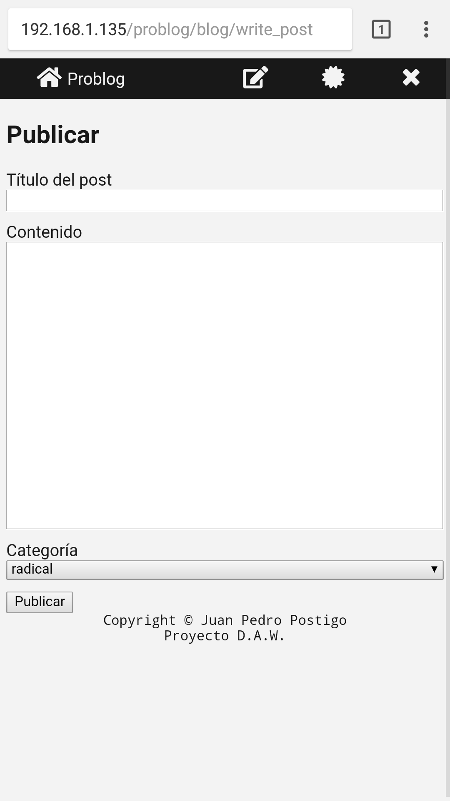
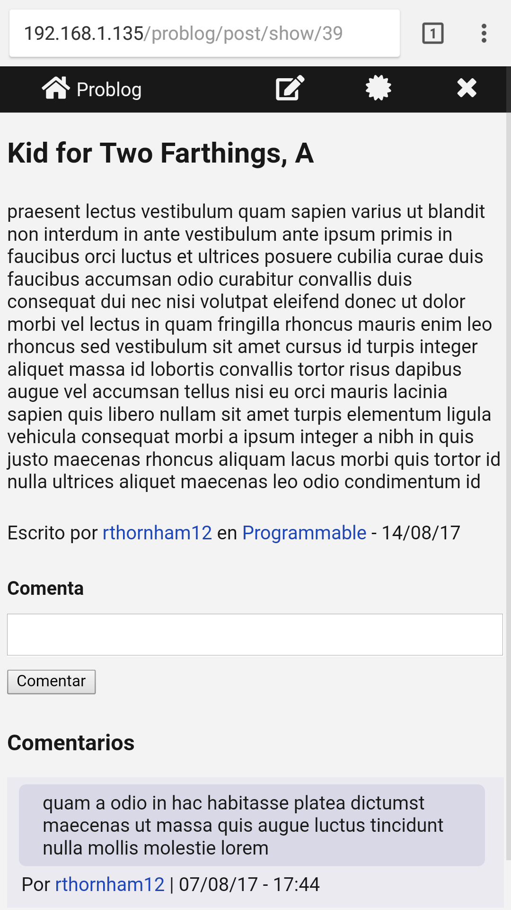
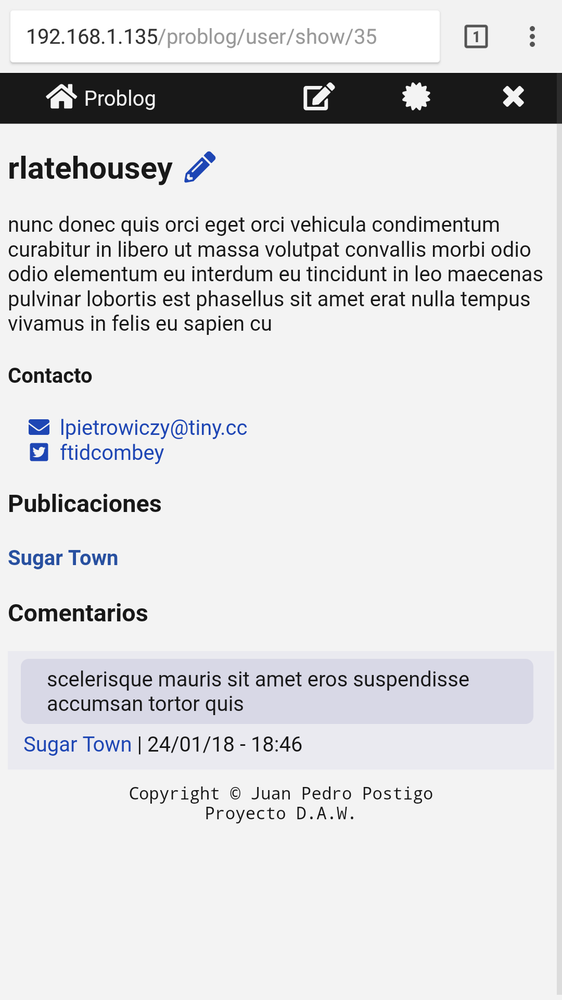
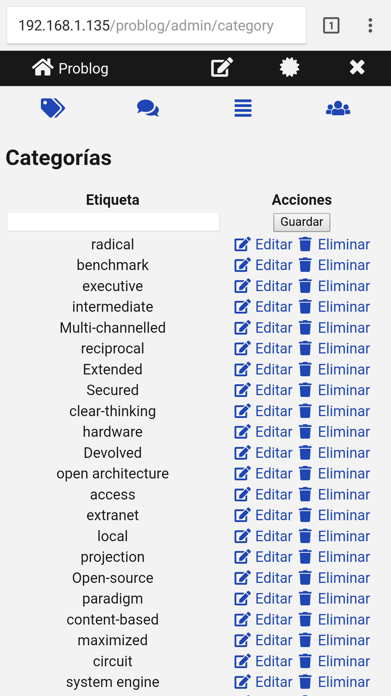
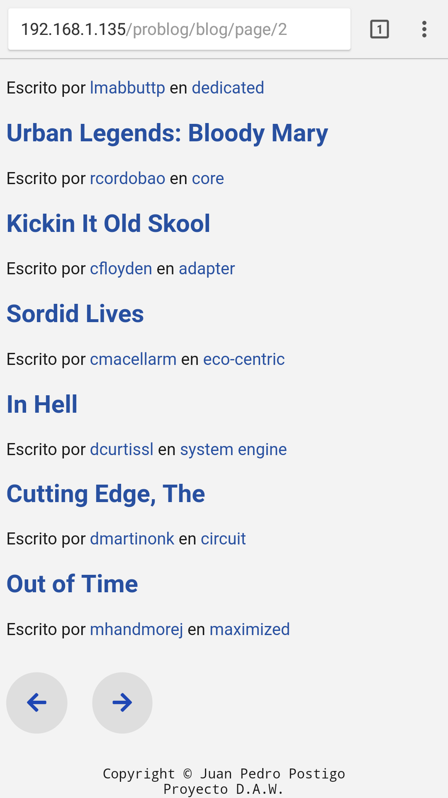

# Problog
## Proyecto DAW - Juan Pedro Postigo

# ¿Qué es problog?

Problog es un blog creado a partir de mi propio framework MVC para PHP, Skr. Las funcionalidades del blog son básicas, tales como:

- Registro y autenticación básica de usuarios
- Posibilidad, para algunos usuarios, de escribir publicaciones en formato Markdown
- Creación, modificación y eliminación de categorías para las publicaciones
- Posibilidad, para cualquier usuario registrado, de comentar las publicaciones
- Panel de administración para ciertos usuarios (administradores y moderadores)
- Perfiles de usuario, donde se aprecia la información sobre el usuario, además de su actividad (publicaciones y comentarios)
- Diseño adaptable para todos los tipos de dispositivos actuales

# ¿Cómo está hecho problog?

Como ya se ha mencionado anteriormente, problog está desarrollado en PHP a partir de Skr Framework, un framework que hace uso del patrón de diseño MVC y que yo mismo desarrollé a finales del pasado 2017. Además de PHP y el susodicho framework, problog utiliza AJAX (en base a jQuery) para realizar ciertas consultas o acciones de forma asíncrona o incluso jQuery como tal para agregar dinamismo a algunos aspectos de la interfaz de usuario.

Problog utiliza también una librería llamada [Parsedown](http://parsedown.org), la cual sirve para convertir el texto en formato Markdown a HTML. Dicha librería está desarrollada en PHP.

El *routing* de problog se ayuda del archivo *.htaccess*, el cual es un archivo propio de los servidores Apache.

# Acceso de prueba a la aplicación

Además de mi usuario personal, puedes acceder y probar la aplicación accediendo con las siguientes credenciales:

- **Usuario**: randomizado
- **Contraseña**: randomsolo

# Capturas de pantalla (versión móvil)

Página principal

Página principal (autenticado)

Formulario de publicación

Vista de post

Vista del perfil de un usuario.
Aclarar que el icono del lápiz azul permite editar al usuario. Dicha funcionalidad solo está permitida para que los moderadores editen usuarios de menor rango y cada usuario se edite a sí mismo.

Panel de administración (categorías). Similar a las otras tres secciones del panel de administración.

Botones de paginación y footer
